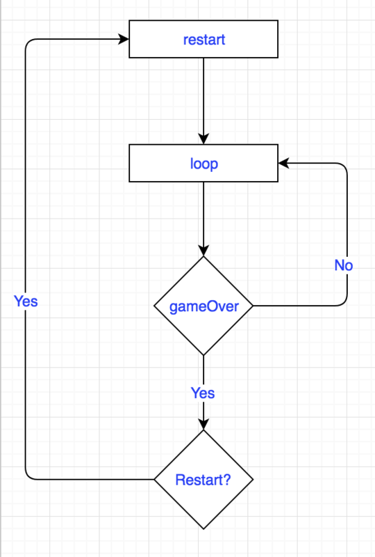

# weixinSmallGame
微信小游戏开发的相关记载
## 微信提供飞机对战demo解析
### 源码目录介绍
```
│  game.js  //游戏入口
│  game.json //游戏配置文件
│  project.config.json //项目配置文件
│
├─audio //音频文件
│      bgm.mp3
│      boom.mp3
│      bullet.mp3
│
├─images //图片资源文件
│      bg.gif
│      bg.jpg
│      bullet.png
│      Common.png
│      enemy.png
│      explosion1.png
│      explosion10.png
│      explosion11.png
│      explosion12.png
│      explosion13.png
│      explosion14.png
│      explosion15.png
│      explosion16.png
│      explosion17.png
│      explosion18.png
│      explosion19.png
│      explosion2.png
│      explosion3.png
│      explosion4.png
│      explosion5.png
│      explosion6.png
│      explosion7.png
│      explosion8.png
│      explosion9.png
│      hero.png
│
└─js
├── base                                   // 定义游戏开发基础类
│   ├── animatoin.js                       // 帧动画的简易实现
│   ├── pool.js                            // 对象池的简易实现
│   └── sprite.js                          // 游戏基本元素精灵类
├── libs
│   ├── symbol.js                          // ES6 Symbol简易兼容
│   └── weapp-adapter.js                   // 小游戏适配器
├── npc
│   └── enemy.js                           // 敌机类
├── player
│   ├── bullet.js                          // 子弹类
│   └── index.js                           // 玩家类
├── runtime
│   ├── background.js                      // 背景类
│   ├── gameinfo.js                        // 用于展示分数和结算界面
│   └── music.js                           // 全局音效管理器
├── databus.js                             // 管控游戏状态
└── main.js                                // 游戏入口主函数

```
### 运行环境
* iOS:JavaScriptCore
* Android:V8
#### 都是没有BOM、DOM的运行环境，没有全局的document和window对象，因此使用DOM API来创建Canvas和Image等元素时，会引发错误。	

### 准备了解
* weapp-adapter:wx API 模拟 BOM 和 DOM 的代码组成的库称之为 Adapter,是对基于浏览器环境的游戏引擎在小游戏运行环境下的一层适配层，使游戏引擎在调用 DOM API 和访问 DOM 属性时不会产生错误。是为了与浏览器中DOM，BOM的概念兼容而写的
* symbol.js:对于ES6中Symbol的极简兼容,方便模拟私有变量
* game.js:游戏入口文件
* game.json:游戏配置文件
* main.js:游戏主函数，包括整个打飞机的游戏场景、参与者（玩家飞机和敌方飞机）、游戏逻辑

### 构思与设计
#### 游戏主逻辑

在loop中，玩家每隔20帧射击一次，每隔60帧生成新的敌机。每帧检查玩家和敌机是否死亡，玩家死亡游戏结束，敌机死亡分数+1.只有玩家可以射击，且射击方式固定，通过躲避敌机生存。

### 分析
> game.js 游戏入口	

```
import './js/libs/weapp-adapter' //兼容浏览器的DOM和BOM的概念
import './js/libs/symbol'

import Main from './js/main'

new Main()

```
> main.js 主函数
```
import Player     from './player/index' 	//玩家
import Enemy      from './npc/enemy' //敌机
import BackGround from './runtime/background'	//背景
import GameInfo   from './runtime/gameinfo'  //分数和结束页面
import Music      from './runtime/music'	背景音乐
import DataBus    from './databus'		//管控游戏状态
//创建canvas
let ctx   = canvas.getContext('2d')
其他代码...
```

> base/sprite.js  游戏基本元素精灵类
* 创建 class Sprite
* 精灵的图片、宽高、位置、是否可见
* drawToCanvas(ctx) 将精灵图绘制在canvas上
* isCollideWith(sp) 简单的碰撞检测定义： 另一个精灵的中心点处于本精灵所在的矩形内即可

> base/pool.js 对象池
* 对象的存贮和重复使用，可以有效减少对象创建开销和避免频繁的垃圾回收，提高游戏性能
* getPoolBySign(name) 根据对象标识符，获取对应的对象池
* getItemByClass(name, className) 根据传入的对象标识符，查询对象池，对象池为空创建新的类，否则从对象池中取
* recover(name, instance) 将对象回收到对象池，方便后续继续使用

> databus.js 管控游戏状态
* let instance 全局变量
* 创建 class DataBus
* this.pool = new Pool() 创建对象池
* reset() 重置
```
reset() {
    this.frame      = 0
    this.score      = 0  //分数
	this.palyerLevel = 1  //等级
    this.bullets    = [] //子弹
    this.enemys     = [] //敌机
    this.animations = []
    this.gameOver   = false
  }
```
*  removeEnemey(enemy) 回收敌机到对象池
*  removeBullets(bullet) 回收子弹到对象池

> animation.js 帧动画的实现
* new DataBus()
* Symbol('timer')
* 创建 class Animation extends Sprite
* 帧动画的类，如图片的资源和宽高、播放状态（isPlaying）、是否循环播放（loop）、每帧时间间隔（interval）、帧定时器[_.timer]、当前播放帧(index)、总帧数count、帧图片集合imgList、全局动画池databus.animations
* initFrames(imgList) 初始化帧动画函数
* aniRender(ctx) 将播放中的帧绘制到canvas上
* playAnimation(index = 0, loop = false) 播放预定义的帧动画函数
* stop() 停止帧动画
* frameLoop() 帧遍历

> libs/symbol.js ES6 Symbol简易兼容

> libs/weapp-adapter.js 小游戏适配器

> npc/enemy.js 敌机
* 敌机图片相关设置
* Symbol('spped') 速度
* new Databus() 游戏状态
* rnd() 随机数函数
* 创建 class Enemy extends Animation
* this.initExplosionAnimation() 调用初始化预定义爆炸的帧动画
* init(speed) 初始化速度
* initExplosionAnimation() 预定义爆炸的帧动画函数
* update() 更新每帧子弹位置

> player/bullet.js 子弹
* 子弹图片相关设置
* Symbol('spped') 速度
* new Databus() 游戏状态
* 创建 class Bullet extends Sprite
* init(x, y, speed) 初始化位置和速度
* update() 更新每帧子弹位置

> player/index.js 玩家
* screenWidth、screenHeight 屏幕的宽高
* 玩家相关常量设置
* new DataBus()
* 创建 class Player extends Sprite
* 玩家默认处于屏幕底部居中位置
```
this.x = screenWidth / 2 - this.width / 2
    this.y = screenHeight - this.height - 30
```
* touched 判断是否手指在飞机上、bullets 子弹数组集合
* initEvent() 调用初始化事件监听
* get level() 获取等级函数
* set level() 设置等级函数
* checkIsFingerOnAir(x, y)  判断触屏是手指是否在飞机上函数
* setAirPosAcrossFingerPosZ(x, y) 设置飞机位子，并保持手指处于飞机中心，同时限制飞机在屏幕范围内函数
* initEvent() 初始化监听事件
* shoot() 玩家射击操作函数

> runtime/background.js 背景
* screenWidth、screenHeight 屏幕的宽高
* 背景相关常量设置
* 创建 class BackGround extends Sprite
* top 图片距离顶部的距离 render(ctx) 调用背景图重绘函数
* render(ctx) 背景图重绘函数

> runtime/gameinfo.js 展示分数和结算界面
* screenWidth、screenHeight 屏幕的宽高
* 图片相关常量设置
* 创建 class GameInfo
* renderGameScore(ctx, score) 左上角的分数显示
* renderPlayerLevel(ctx,level) 玩家等级文本显示
*  renderGameOver(ctx, score)  游戏结束弹框--文本、重新开始按钮

> runtime/music.js 全局音效管理器
* let instance
* 创建 class Music
* 判断并赋值instance = this
* 添加背景音乐资源
* this.playBgm() 调用播放背景音乐函数
* playBgm() 播放背景音乐函数
* playShoot() 播放射击音乐函数
* playExplosion() 播放玩家爆炸音乐函数

### 玩家升级
1.玩家初始等级为1，玩家可通过击杀敌机升级，每击落30敌机升级一次，		
2.玩家每升级一次，增加一个射击口，		
3.玩家最多升级两次。	
#### 步骤
#### 在databus.js，将等级逻辑加入到玩家的类中

```
其他代码...
	reset() {
		this.frame      = 0
		this.score = 0  //分数
		this.palyerLevel = 1  //等级
		this.bullets    = [] //子弹
		this.enemys     = [] //敌机
		this.animations = []
		this.gameOver   = false
	  }
  其他代码...
```
##### 打开player/index.js，实现等级增加		

```
export default class Player extends Sprite {
  constructor() {
    super(PLAYER_IMG_SRC, PLAYER_WIDTH, PLAYER_HEIGHT)

    // 玩家默认处于屏幕底部居中位置
    this.x = screenWidth / 2 - this.width / 2
    this.y = screenHeight - this.height - 30

    // 用于在手指移动的时候标识手指是否已经在飞机上了
    this.touched = false

    this.bullets = []

    // 初始化事件监听
    this.initEvent()

  }

 get level() {//获取main.js中的this.player.level
    return databus.palyerLevel;
  }
  set level(level){
    databus.palyerLevel = Math.min(level,3);
  }
```
##### 接下来在main.js的update函数加入升级逻辑。

```
// 其他代码...

    update() {
        this.bg.update();

        databus.bullets.concat(databus.enemys).forEach(item => {
            item.update();
        });

        this.enemyGenerate();

        this.player.level = Math.max(1, Math.ceil(databus.score / 30));

        this.collisionDetection();
    }

// 其他代码...
```
##### 设置奖励，增加射击口

```
// ...其他代码

    /**
     * 玩家射击操作
     * 射击时机由外部决定
     */
    shoot() {


      for(let i = 0; i < this.level; i++) {
        const bullet = databus.pool.getItemByClass('bullet', Bullet);
        const middle = this.x + this.width / 2 - bullet.width / 2;
        const x = !i ? middle : (i % 2 === 0 ? middle + 30 : middle - 30);
        bullet.init(
          x,
          this.y - 10,
          10
        )

        databus.bullets.push(bullet)
      }
    }

// ...其他代码
```

#### 效果展示图
